# 说明 | development doc
## 前言 | things at first
这是一个使用ionic实现的服务外包客户端，主要配置在安卓上。

it is a demo of our service outsourcing competition project, mainly developed at web browser(chrome) and android platform.

## 配置 | get started
在默认的基础上增加了call-number与一个绘画板的模块，开发人员只需增加以下命令：
```$xslt
npm install
```


## 页面与原型的对应 | correlation to prototype
login->登陆页面

contact->会话

contract->合同

contract-writing->合同起草

contract-supervision->合同审核

contract-management->合同管理

contract-consultant->法律助手

about->我的
## 开发注意事项 | development notes
### 1. 
图片不能用相对路径，否则会造成安卓无法读取的情况，统一放在
> asset/imgs/

目录下，填写src目录时用例为：
```

```
### 2.
新建页面有教程，见参考资料。

### 3.
命名规范：若其是一个页面alice的子页面bob，则在命令中输入：
```
ionic g page aliceBob
```
具体可参照contract->contractWriting 这样的写法

## 界面预览|preview

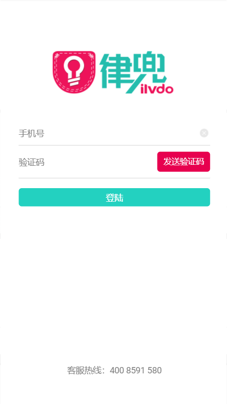

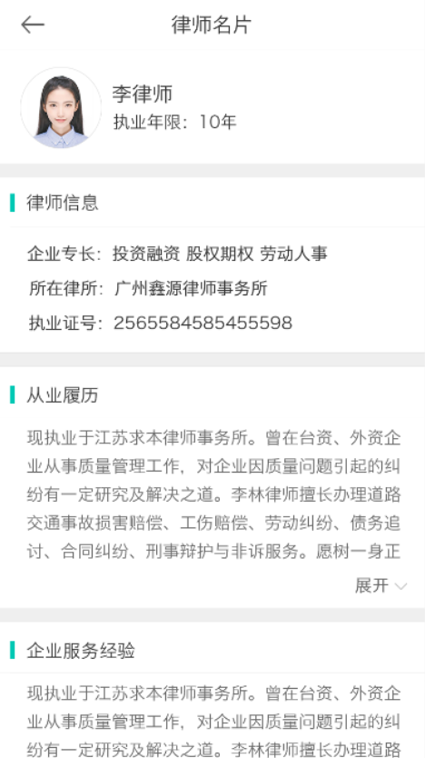

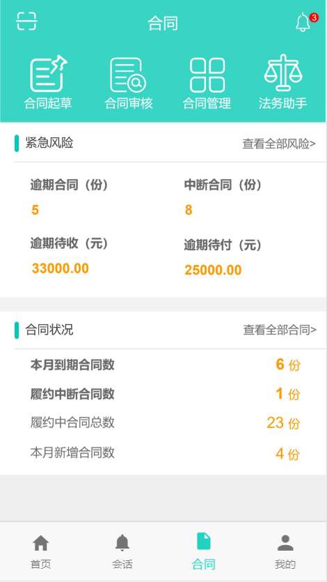
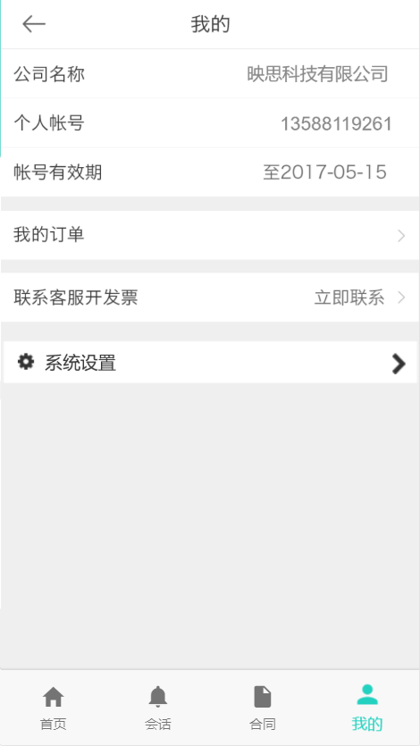
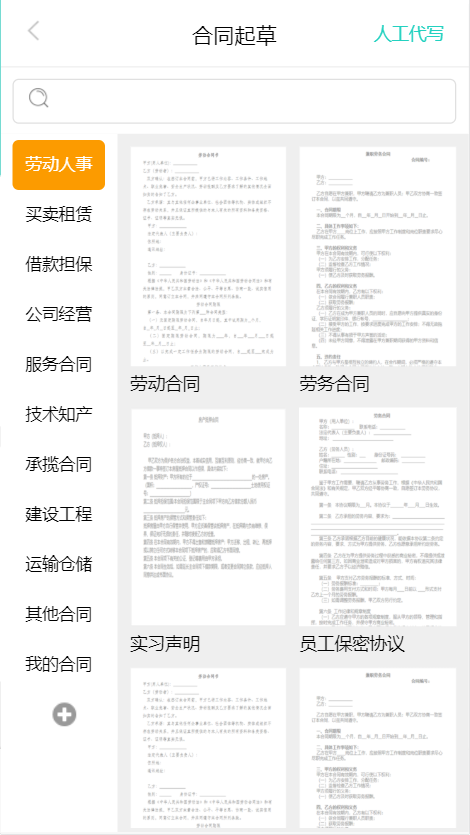
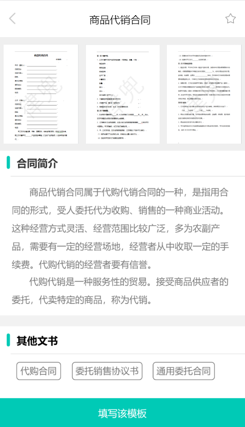
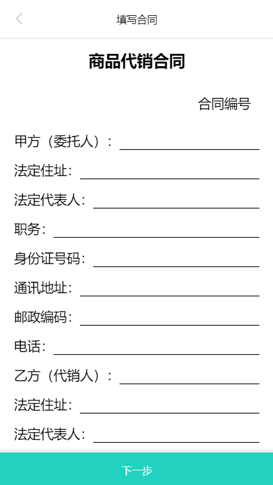
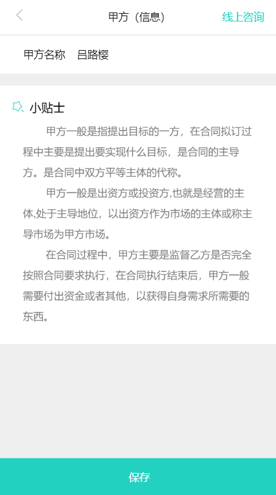
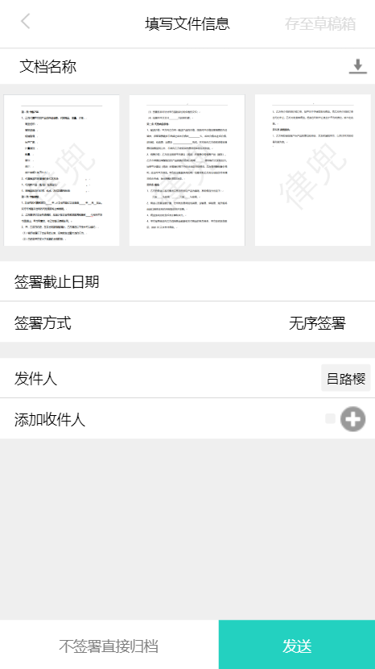
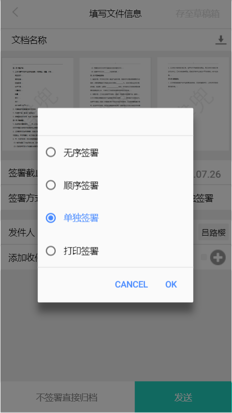
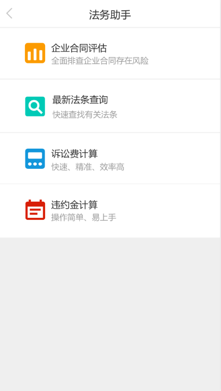
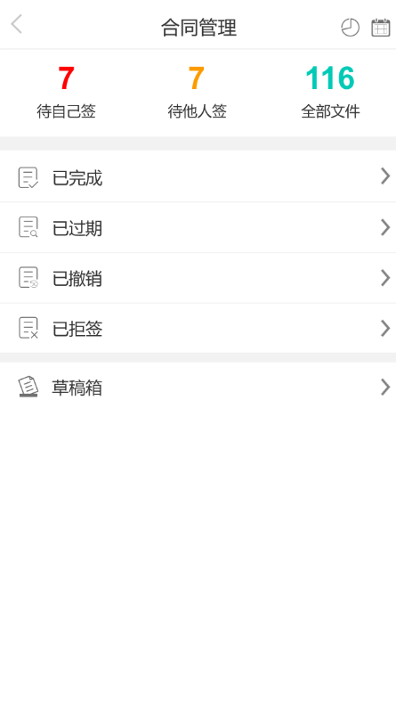
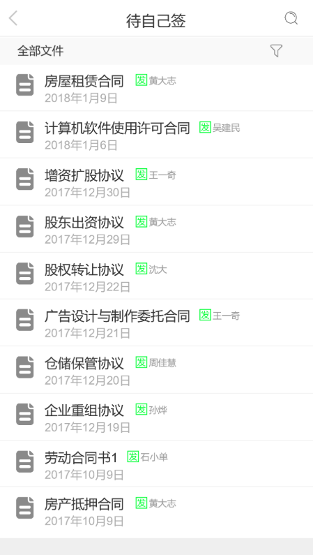
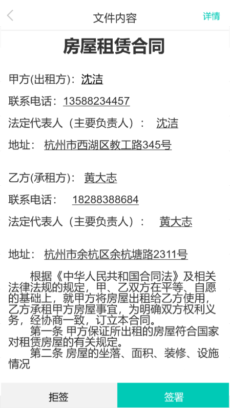
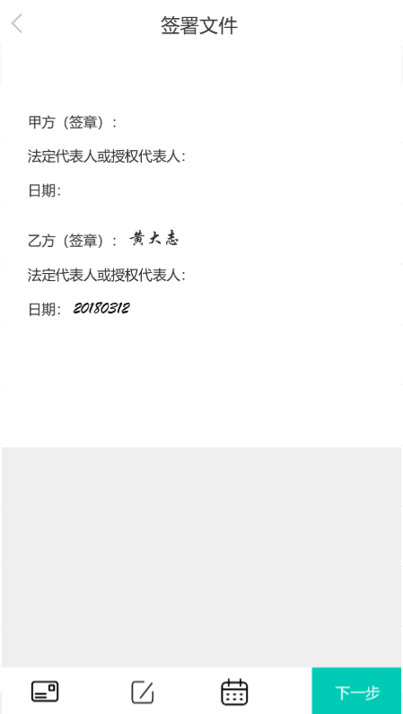
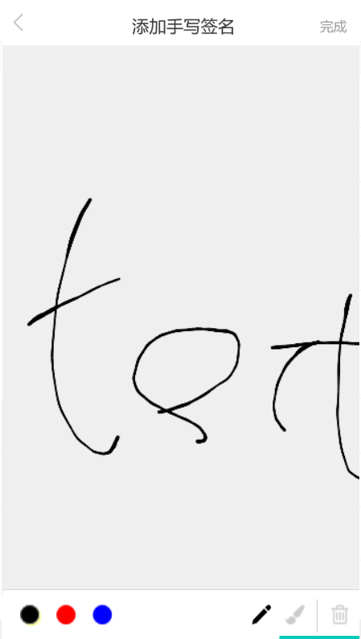
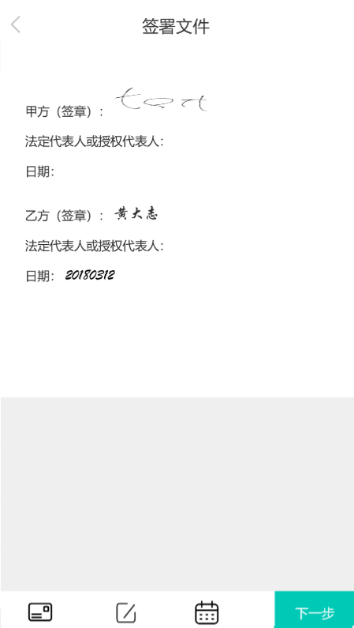


